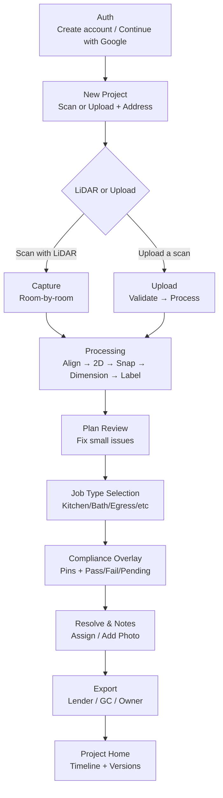

# LiDAR App

This is a Next.js application based on the detailed wireframe and flow provided. It serves as the foundational codebase for the LiDAR App.

## High-Level Flow

This diagram illustrates the user flow through the application, from authentication to project export.



## Getting Started

First, install the dependencies:
```bash
npm install
```

Then, run the development server:

```bash
npm run dev
```

Open [http://localhost:3000](http://localhost:3000) with your browser to see the result.
